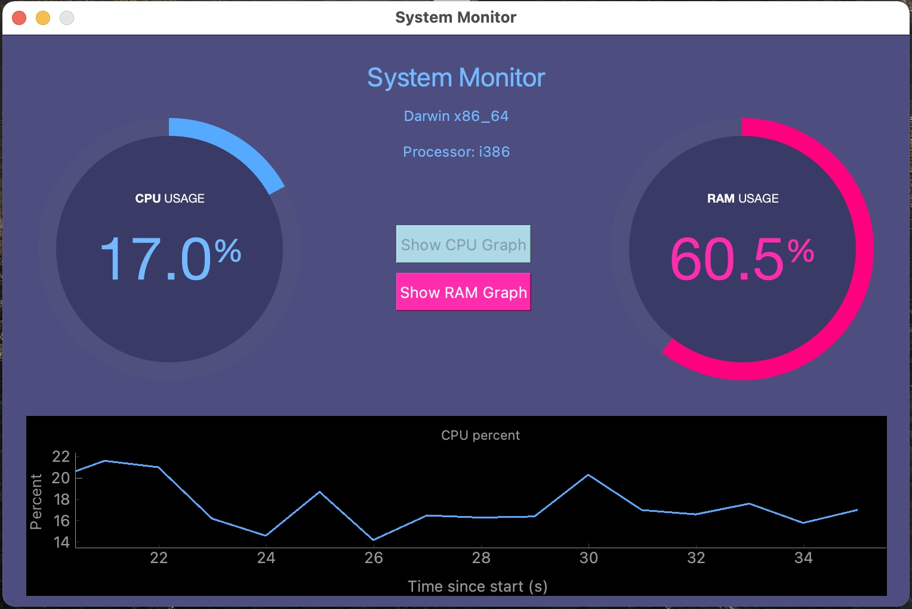

# System Monitor

## Command Line Execution

```
python systemMonitor.py
```

## Libraries required
```
altgraph==0.17
importlib-metadata==3.4.0
macholib==1.14
numpy==1.19.5
psutil==5.8.0
PyQt5==5.15.2
PyQt5-sip==12.8.1
pyqtgraph==0.11.1
typing-extensions==3.7.4.3
zipp==3.4.0
```

<p align="center">
 
</p>
